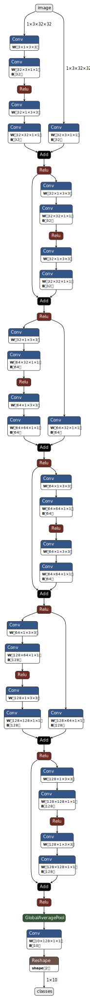
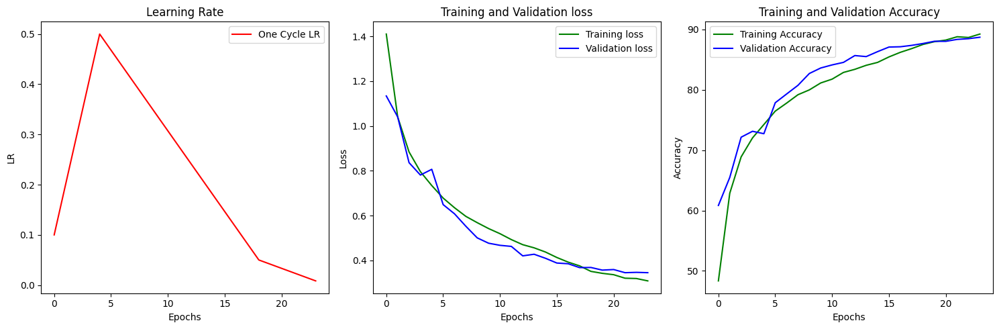
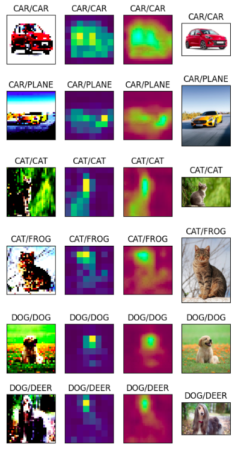
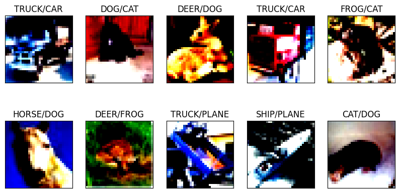
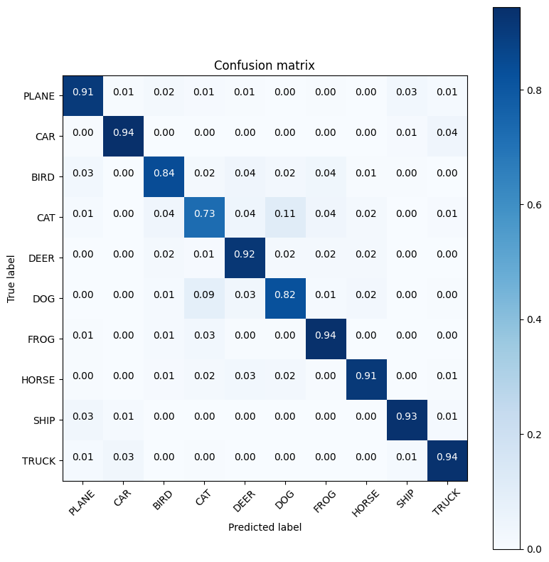

# This file shows how to build a model to train on CIFAR using Dilated Convolution, and Depthwise Separable Convolution.

A network trained on CIFAR 10 dataset. This model is built using most possible optimization techniques like Dilated Convolution, Depthwise Separable Convolution, Skip connection, and Pointwise Convolution

We will be showing the following
1. Network Architecture
2. Parameters And Model Summary
3. Model Performance
4. Training Logs
5. GradCam Output
6. Incorrect Predictions
7. Confusion Metrics

<b>Network Architecture</b>



<b>Parameters And Model Summary</b>

```
----------------------------------------------------------------
Using Normalization: bn
Using 1*1 Skip Connection: True
Convolution Type: depthwise_seperable
Number of Blocks: 3
Number of Layers Per Block: 6
Use Dilation: True
----------------------------------------------------------------
Pading: 0 Sride: 1 Dilation: (1, 1)
KernelSize: 3
OutputHeight: 32.0 OutputWidth: 32.0
Dilation (9, 9)
Pading: 0 Sride: 1 Dilation: (9, 9)
Height: 16.0 Width: 16.0
KernelSize: 19
OutputHeight: 16.0 OutputWidth: 16.0
Dilation (5, 5)
Pading: 0 Sride: 1 Dilation: (5, 5)
Height: 8.0 Width: 8.0
KernelSize: 11
OutputHeight: 8.0 OutputWidth: 8.0
----------------------------------------------------------------
        Layer (type)               Output Shape         Param #
================================================================
            Conv2d-1            [-1, 3, 32, 32]              27
            Conv2d-2           [-1, 32, 32, 32]              96
          WyConv2d-3           [-1, 32, 32, 32]               0
       BatchNorm2d-4           [-1, 32, 32, 32]              64
            Conv2d-5           [-1, 32, 32, 32]             288
            Conv2d-6           [-1, 32, 32, 32]           1,024
          WyConv2d-7           [-1, 32, 32, 32]               0
       BatchNorm2d-8           [-1, 32, 32, 32]              64
            Conv2d-9           [-1, 32, 32, 32]              96
         WyConv2d-10           [-1, 32, 32, 32]               0
      BatchNorm2d-11           [-1, 32, 32, 32]              64
       WyResidual-12           [-1, 32, 32, 32]               0
           Conv2d-13           [-1, 32, 32, 32]             288
           Conv2d-14           [-1, 32, 32, 32]           1,024
         WyConv2d-15           [-1, 32, 32, 32]               0
      BatchNorm2d-16           [-1, 32, 32, 32]              64
           Conv2d-17           [-1, 32, 32, 32]             288
           Conv2d-18           [-1, 32, 32, 32]           1,024
         WyConv2d-19           [-1, 32, 32, 32]               0
      BatchNorm2d-20           [-1, 32, 32, 32]              64
       WyResidual-21           [-1, 32, 32, 32]               0
          WyBlock-22           [-1, 32, 32, 32]               0
           Conv2d-23           [-1, 32, 16, 16]             288
           Conv2d-24           [-1, 64, 16, 16]           2,048
         WyConv2d-25           [-1, 64, 16, 16]               0
      BatchNorm2d-26           [-1, 64, 16, 16]             128
           Conv2d-27           [-1, 64, 16, 16]             576
           Conv2d-28           [-1, 64, 16, 16]           4,096
         WyConv2d-29           [-1, 64, 16, 16]               0
      BatchNorm2d-30           [-1, 64, 16, 16]             128
           Conv2d-31           [-1, 64, 16, 16]           2,048
         WyConv2d-32           [-1, 64, 16, 16]               0
      BatchNorm2d-33           [-1, 64, 16, 16]             128
       WyResidual-34           [-1, 64, 16, 16]               0
           Conv2d-35           [-1, 64, 16, 16]             576
           Conv2d-36           [-1, 64, 16, 16]           4,096
         WyConv2d-37           [-1, 64, 16, 16]               0
      BatchNorm2d-38           [-1, 64, 16, 16]             128
           Conv2d-39           [-1, 64, 16, 16]             576
           Conv2d-40           [-1, 64, 16, 16]           4,096
         WyConv2d-41           [-1, 64, 16, 16]               0
      BatchNorm2d-42           [-1, 64, 16, 16]             128
       WyResidual-43           [-1, 64, 16, 16]               0
          WyBlock-44           [-1, 64, 16, 16]               0
           Conv2d-45             [-1, 64, 8, 8]             576
           Conv2d-46            [-1, 128, 8, 8]           8,192
         WyConv2d-47            [-1, 128, 8, 8]               0
      BatchNorm2d-48            [-1, 128, 8, 8]             256
           Conv2d-49            [-1, 128, 8, 8]           1,152
           Conv2d-50            [-1, 128, 8, 8]          16,384
         WyConv2d-51            [-1, 128, 8, 8]               0
      BatchNorm2d-52            [-1, 128, 8, 8]             256
           Conv2d-53            [-1, 128, 8, 8]           8,192
         WyConv2d-54            [-1, 128, 8, 8]               0
      BatchNorm2d-55            [-1, 128, 8, 8]             256
       WyResidual-56            [-1, 128, 8, 8]               0
           Conv2d-57            [-1, 128, 8, 8]           1,152
           Conv2d-58            [-1, 128, 8, 8]          16,384
         WyConv2d-59            [-1, 128, 8, 8]               0
      BatchNorm2d-60            [-1, 128, 8, 8]             256
           Conv2d-61            [-1, 128, 8, 8]           1,152
           Conv2d-62            [-1, 128, 8, 8]          16,384
         WyConv2d-63            [-1, 128, 8, 8]               0
      BatchNorm2d-64            [-1, 128, 8, 8]             256
       WyResidual-65            [-1, 128, 8, 8]               0
          WyBlock-66            [-1, 128, 8, 8]               0
AdaptiveAvgPool2d-67            [-1, 128, 1, 1]               0
           Conv2d-68             [-1, 10, 1, 1]           1,290
================================================================
Total params: 95,653
Trainable params: 95,653
Non-trainable params: 0
----------------------------------------------------------------
Input size (MB): 0.01
Forward/backward pass size (MB): 9.31
Params size (MB): 0.36
Estimated Total Size (MB): 9.68
----------------------------------------------------------------
```

<b>Model Performance</b>



<b>Training Logs</b>

```
Using Device: cuda
Epochs: 24
Lr: 0.05
Max Lr: 0.5
Batch Size: 128
Dropout: True
Dropout Ratio: 0.01
Momentum: 0.9
Weight Decay: 9.765625e-07
Use L1: True
L1 Lambda: 1e-07
-------------------------------------------------------------------------
| Epoch | LR       | Time    | TrainLoss | TrainAcc | ValLoss  | ValAcc |
-------------------------------------------------------------------------
|     1 | 0.100000 | 00m 08s | 1.41032   | 48.34  % | 1.133955 | 60.84% |
|     2 | 0.200000 | 00m 08s | 1.040776  | 62.86  % | 1.040624 | 65.48% |
|     3 | 0.300000 | 00m 08s | 0.884307  | 68.89  % | 0.836413 | 72.15% |
|     4 | 0.400000 | 00m 08s | 0.796011  | 72.03  % | 0.780911 | 73.13% |
|     5 | 0.500000 | 00m 08s | 0.734024  | 74.25  % | 0.806540 | 72.73% |
|     6 | 0.467857 | 00m 08s | 0.678187  | 76.47  % | 0.649100 | 77.86% |
|     7 | 0.435714 | 00m 08s | 0.635036  | 77.8   % | 0.607898 | 79.31% |
|     8 | 0.403571 | 00m 08s | 0.596455  | 79.19  % | 0.552274 | 80.75% |
|     9 | 0.371429 | 00m 08s | 0.568372  | 79.99  % | 0.500478 | 82.71% |
|    10 | 0.339286 | 00m 08s | 0.542016  | 81.14  % | 0.476658 | 83.62% |
|    11 | 0.307143 | 00m 08s | 0.519221  | 81.77  % | 0.467265 | 84.13% |
|    12 | 0.275000 | 00m 08s | 0.49281   | 82.88  % | 0.462444 | 84.55% |
|    13 | 0.242857 | 00m 08s | 0.470152  | 83.4   % | 0.420203 | 85.68% |
|    14 | 0.210714 | 00m 08s | 0.456086  | 84.07  % | 0.427420 | 85.51% |
|    15 | 0.178571 | 00m 08s | 0.437362  | 84.55  % | 0.409435 | 86.33% |
|    16 | 0.146429 | 00m 08s | 0.412997  | 85.45  % | 0.388248 | 87.09% |
|    17 | 0.114286 | 00m 08s | 0.392131  | 86.22  % | 0.385041 | 87.14% |
|    18 | 0.082143 | 00m 08s | 0.375659  | 86.83  % | 0.367789 | 87.37% |
|    19 | 0.050000 | 00m 08s | 0.350944  | 87.53  % | 0.368337 | 87.68% |
|    20 | 0.041667 | 00m 08s | 0.342248  | 87.98  % | 0.356605 | 88.05% |
|    21 | 0.033333 | 00m 09s | 0.336114  | 88.25  % | 0.359100 | 88.04% |
|    22 | 0.025000 | 00m 08s | 0.320475  | 88.8   % | 0.345094 | 88.36% |
|    23 | 0.016667 | 00m 08s | 0.319075  | 88.68  % | 0.346614 | 88.48% |
|    24 | 0.008333 | 00m 08s | 0.308498  | 89.25  % | 0.345160 | 88.72% |
-------------------------------------------------------------------------
```

<b>GradCam Output</b>



<b>Incorrect Predictions</b>



<b>Confusion Matrix</b>


